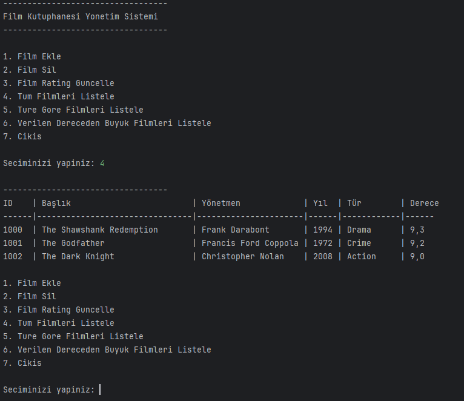

# Movie Library Management Project

This project will be a Java application that simulates the management of a movie library. It will allow users to add, delete, update, and list movies.

## 1. **Movie Class**
A class representing each movie in the library.
- `id`: Movie ID (int or String)
- `title`: Movie title (String)
- `director`: Movie director (String)
- `releaseYear`: Movie release year (int)
- `genre`: Movie genre (String)
- `rating`: Movie rating (double or int)

## 2. **FilmLibrary Class**
A class responsible for managing movie operations.
- It will use `ArrayList<Movie>` to store the movies.
- Methods for basic operations such as adding, deleting, and updating movies.
- A method to list all movies.
- Methods for searching a specific movie or based on specific criteria (e.g., director or genre).

## 3. **FilmLibraryApp Class**
The main class where the application will be launched.
- It will provide commands for the user to add, delete, and update movies.
- It will provide commands for the user to search and list movies.
- It will handle user input and output.

## 4. Example Output

  

###

This project is a suitable example for understanding Object-Oriented Programming (OOP) principles. By following each step and completing the required functionalities, you can gain a better understanding of OOP concepts in Java.

## Proje Açıklaması (Türkçe)

Bu proje, bir film kütüphanesinin yönetimini simüle eden bir Java uygulaması olacak. Kullanıcıların film eklemesine, silmesine, güncellemesine ve listelemesine olanak tanıyacak.

## 1. **Movie Class**
Film (Movie) Sınıfı: Kütüphanedeki her filmi temsil edecek sınıf.
- `id`: Film ID'si (int veya String)
- `title`: Film adı (String)
- `director`: Film yönetmeni (String)
- `releaseYear`: Film çıkış yılı (int)
- `genre`: Film türü (String)
- `rating`: Film derecesi (double veya int)

## 2. **FilmLibrary Class**   
FilmLibrary (Film Kütüphanesi) Sınıfı: Film işlemlerini yönetecek olan sınıf.
- `ArrayList<Movie>` kullanarak filmleri depolayacak.
- Film ekleme, silme, güncelleme gibi temel işlemleri gerçekleştiren metotlar.
- Tüm filmleri listeleme metodu.
- Belirli bir filmi veya belirli bir kriter (örneğin, yönetmen veya tür) ile arama metotları.

## 3. **FilmLibraryApp Class**
FilmLibraryApp (Film Kütüphanesi Uygulaması) Sınıfı: Uygulamanın başlatıldığı ana sınıf olacak.
- Kullanıcıya film ekleme, silme, güncelleme gibi işlemleri yapabilmesi için komutlar sunacak.
- Kullanıcıya film arama ve listeleme gibi işlemleri yapabilmesi için komutlar sunacak.
- Kullanıcı giriş ve çıkışı sağlayacak.

## 4. Örnek Çıktı

  

Bu proje, Nesne Yönelimli Programlama (OOP) mantığını anlamak için uygun bir örnektir. Her adımı takip ederek ve gerekli işlevleri tamamlayarak Java'da OOP konseptlerini daha iyi anlayabilirsiniz.